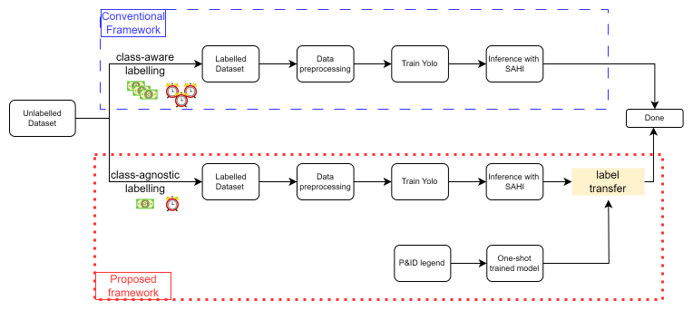
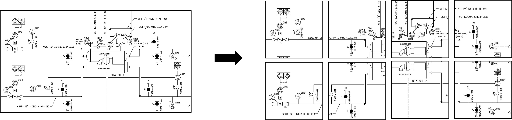
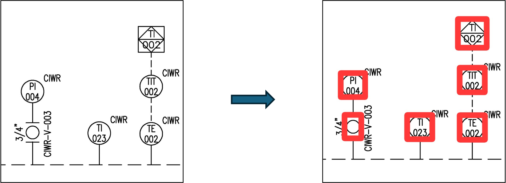
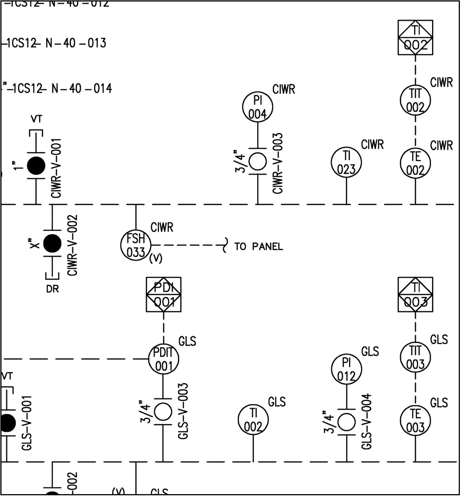

# PID_Symbol_Detection

### Proposed Framework vs Conventional Framework

### Benefits of Proposed Framework
Class-Agnostic Object Detection & One-shot Label Transfer is found to be more:
1. Generalizable to different underlying P&ID drawing styles
2. Robust to class-imbalance
compared to equivalent class-aware counterparts.

### Simplified Visual Walkthrough of Proposed Framework 

#### 1. Data preprocessing

#### 2. Train Yolo (Stage-1)

#### 3. Inferencing with SAHI (Stage-1)

#### 4. Label Transfer (Stage-2)
