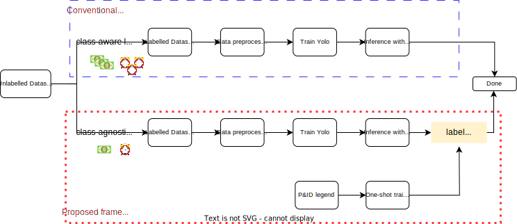
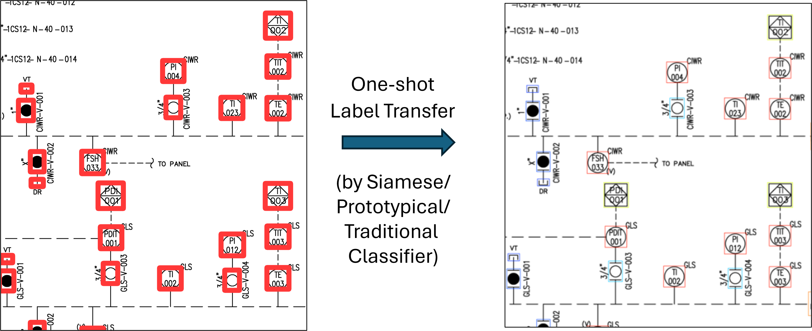

# PID_Symbol_Detection

### Proposed Framework vs Conventional Framework

### Benefits of Proposed Framework
Class-Agnostic Object Detection & One-shot Label Transfer is found to be more:
1. Generalizable to different underlying P&ID drawing styles
2. Robust to class-imbalance
compared to equivalent class-aware counterparts.

### Simplified Visual Walkthrough of Proposed Framework 

#### 1. Data preprocessing
This step breaks down large P&ID sheets into overlapping patches. 

Plus, class-aware labels are transformed into class-agnostic to prepare for training a Yolo object detection model.

#### 2. Train Yolo (Stage-1)
Trains a 'Generic' symbol detector

#### 3. Inferencing with SAHI (Stage-1)
For large P&IDs infer on smaller patches and combine the results (implemented via <a href="https://github.com/obss/sahi" SAHI </a>).

#### 4. Label Transfer (Stage-2)
Train a model using one labeled image per symbol class (e.g. P&ID legend). The model can be a Siamese Network/ Prototypical (Zero-shot) Network or a Traditional classifier trained on augmented images.

